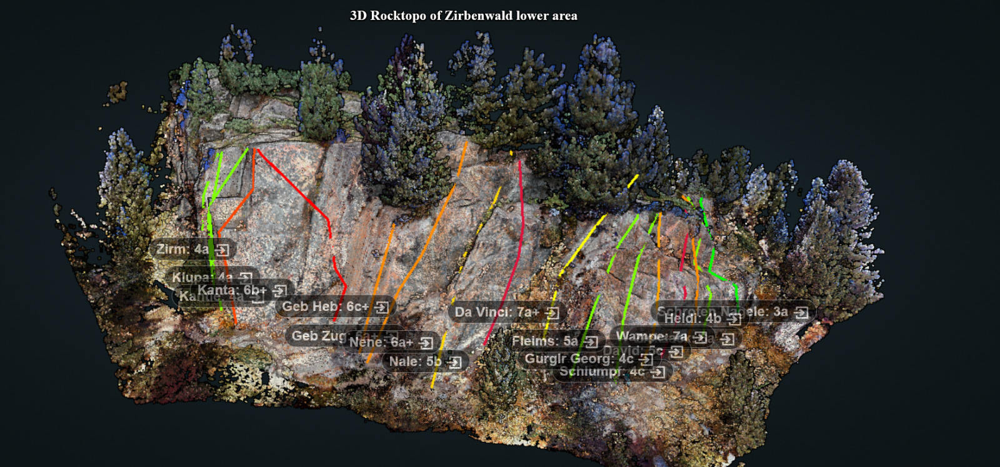

# Rocktopo Obergurgl using Potree

This repository contains files for reproducing the 3D point cloud visualization of Rocktopo Obergurgl using Potree, an open-source WebGL-based point cloud renderer. The dataset is split into two views: rocktopo_bottom and rocktopo_upper, which can be accessed through a browser once the Node.js server is running.


## Overview

Potree is a powerful tool for visualizing large 3D point cloud datasets in a web browser. The Rocktopo Obergurgl dataset, derived from detailed terrain mapping, is available for visualization in two parts, offering a comprehensive view of the terrain structure.
Files in the Repository

    rocktopo_bottom.html – Displays the lower section of the Obergurgl dataset.
    rocktopo_upper.html – Displays the upper section of the Obergurgl dataset.

Both files can be viewed in a web browser once the server is set up.

## Installation

To set up the project, follow these steps:
1. Install Potree

First, you need to install Potree. Follow the installation guide from the official [Potree GitHub](https://github.com/potree/potree) repository. You could also load the PotreeConverter to convert new or other point clouds into a format Potree can render over at [Potree Converter](https://github.com/potree/potreeconverter).

2. Clone this Repository

Next, clone this repository to your local machine into the main potree folder:

```bash
git clone https://github.com/jurriandoornbos/potree-rocktopo.git
```

3. Download the Dataset

The Rocktopo Obergurgl point cloud dataset can be downloaded from [Zenodo](https://doi.org/10.5281/zenodo.13838949). Recommended to use the Potree preprocessed datasets: `bottom_cloud.zip` and `upper_cloud.zip`. Extract these as folders into the file folder of this repository. The html files assume the folders are named: `bottom_cloud` and `upper_cloud` and `segmented_bottom` and `segmented_upper`. All should be extracted into a subfolder: `potree/potree-rocktopo/clouds/` with `bottom_cloud` folders etc located right there.


4. Run the Server
To start the Potree viewer, run:

```bash
npm start
```

This will launch a web server. You can then open your browser and view the point clouds by navigating to:

    localhost:1234/potree-rocktopo/rocktopo_bottom.html
    localhost:1234/potree-rocktopo/rocktopo_upper.html

## Usage

Once the server is running, the point clouds can be explored directly in your web browser. Navigate, zoom, and inspect the terrain using Potree’s interactive interface.
License

This project is licensed under the Apache License v2. See the LICENSE file for details.